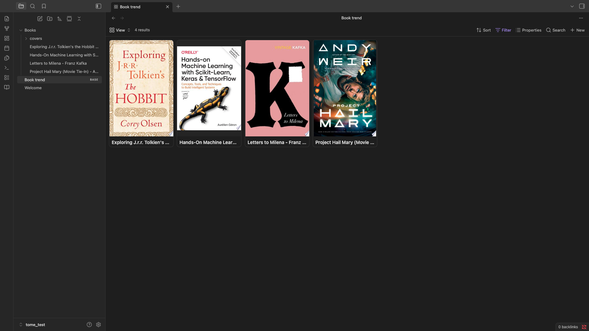

# Tome

Search books by ISBN or title across **Open Library**, **Google Books**, and **OpenAlex**, download their covers locally, and organize everything as plain Markdown notes — ratings, reading status, and progress included. Fully frontmatter-based, so your book library works seamlessly with Dataview, Obsidian Bases, and any other plugin that reads YAML properties.

## Why I built this

I wanted a proper visual library of the books I'm reading inside Obsidian — something like the card-gallery setups you see in Notion or Readwise, but native to my vault. I tried a few existing community plugins for this first, and kept running into the same wall: broken searches, covers that never actually downloaded, or note templates that didn't play nicely with Obsidian's newer Bases feature. Nothing quite worked end-to-end the way I wanted.

So I built Tome — a plugin where the entire flow, from search to a cover you can actually see in a Bases card view, just works, is transparent about its data sources, and stores everything as portable Markdown rather than locking your library into a proprietary format.

## Features

- **Multi-provider search** — queries Open Library, Google Books, and OpenAlex, with configurable provider order and per-provider enable/disable toggles
- **Local cover caching** — downloads cover images into your vault so your library works offline and stays stable even if a provider changes URLs
- **Frontmatter-first** — every book note stores metadata (title, authors, ISBN, publisher, subjects, status, rating, progress, and more) as YAML properties, ready for Dataview or Bases
- **Built-in gallery view** — browse your library as a card grid without any extra setup
- **Bases-ready** — point an Obsidian Base at your notes folder, switch to Cards view, and covers render automatically from the `cover` frontmatter property
- **Customizable templates** — control the exact frontmatter fields and note body layout to fit your existing vault conventions
- **Rate-limit resilient** — automatic retry with backoff, and an optional Google Books API key / OpenAlex contact email to raise your quota ceiling

## Installation

### From the Community Plugins directory

_(Once published)_ Settings → Community plugins → Browse → search "Tome" → Install → Enable.

### Manual installation

1. Download `main.js`, `manifest.json`, and `styles.css` from the [latest release](../../releases).
2. Create a folder `<your-vault>/.obsidian/plugins/tome/` and place the three files inside.
3. In Obsidian: Settings → Community plugins → enable **Tome**.

## Setup

Open Settings → Tome to configure:

- **Providers** — enable/disable Open Library, Google Books, and OpenAlex individually.
- **Google Books API key** _(optional but recommended)_ — raises your daily quota well above the shared unauthenticated limit. Get a free key from [Google Cloud Console](https://console.cloud.google.com/): enable the Books API under APIs & Services, then generate an API key under Credentials.
- **OpenAlex contact email** _(optional)_ — puts your requests in OpenAlex's faster "polite pool" rate-limit tier. OpenAlex is primarily a scholarly/academic metadata fallback and rarely returns cover images.
- **Notes folder** / **Covers folder** — where new book notes and downloaded cover images are stored.
- **Note template** — the full frontmatter + body template used for every new note. Supports Templater syntax if you have that plugin installed.

## Usage

1. Run **Tome: Add a book** from the command palette.
2. Search by title or ISBN.
3. Select a result, set your reading status and rating, and create the note.
4. Run **Tome: Open library gallery** to browse your collection as cards, or set up an Obsidian Base pointed at your notes folder for a fully customizable card view.

### Using with Obsidian Bases

1. Create a new Base (or a new view) filtered to your book notes — e.g. `tags contains "book"`.
2. Switch the view to **Cards**.
3. In Card view settings, set **Image property** to `cover`.

That's it — covers render automatically, pulled straight from the frontmatter Tome writes.

## Roadmap

- Distinguish "no results found" from "provider temporarily rate-limited" in the search UI
- Additional provider support

## Contributing

Issues and pull requests are welcome. Please open an issue first for larger changes so we can discuss the approach.

## License

[MIT](LICENSE)
